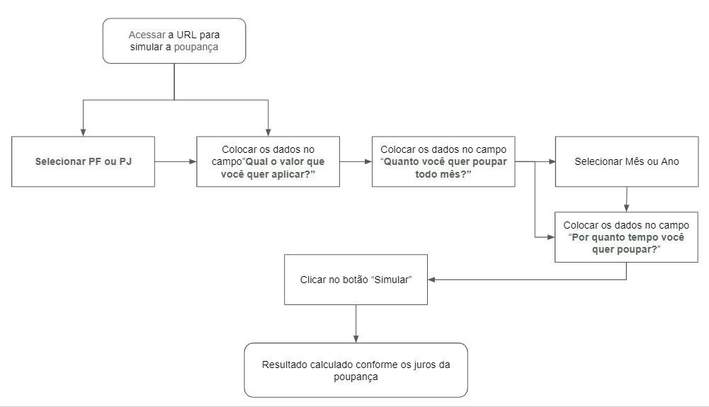
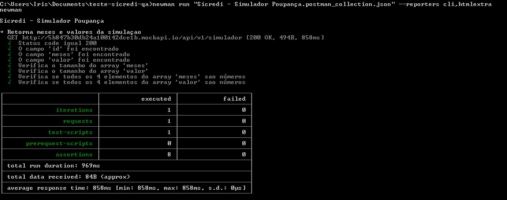

# Teste da Plataforma Digital Sicredi

#### Motivador do Projeto
Garantir que o usuário consiga analisar o resultado do seu investimento na Poupança do Sicredi e que os cálculos estejam de acordo com os juros da Poupança. 

#### Situação Desejada
Proporcionar a visualização dos valores de rendimento do valor aplicado na Poupança Sicredi para o usuário.

###### Preparação
A técnica utilizada foi o Teste Funcional (caixa-preta), pois ele é baseado nos requisitos funcionais do software e é focado na saída gerada após a entrada de dados especificados. Não será testado caixa-branca e nem caixa-cinza, pois eu não tenho acesso ao código do sistema.

Para que os testes sejam realizados, foram utilizadas as seguintes ferramentas:
- Selenium para testar front-end
- Node JS
- Postman e Newman para testar a API
- Visual Studio Code como IDE
- Git

Foi criado um fluxograma do processo de escolha do usuário (associado), conforme a imagem:

Com base nas possibilidades de sucesso e insucesso, foram criados 8 cenários e os Requisitos Funcionais e de Negócio, disponíveis no link:
https://docs.google.com/spreadsheets/d/1G0ghAYDYnEa6lnZ082ibYRQoC62wAJr6tFMDDU3g2Rk/edit?usp=sharing

#### Instruções para executar a automação de testes com Newman (Teste de API)
1. No repositório existe o arquivo 'Sicredi - Simulador Poupança.postman_collection.json' com a collection que roda no Postman e Newman

2. O Newman serve para executar em linhas de comando as collections do Postman

3. Você precisa instalar o newman: `npm install -g newman`

4. Para gerar um relatório em Dashboard, você precisa instalar: `npm install -g newman-reporter-htmlextra`

5. Para gerar o relatório HTML EXTRA e também a saída no console, é preciso executar: `newman run "Sicredi - Simulador Poupança.postman_collection.json" --reporters cli,htmlextra`

6. No repositório existe um arquivo .html com o exemplo do HTML EXTRA gerado

#### Instruções para executar a automação de testes com Selenium (Teste de UI)

1. Você precisa instalar o selenium-webdriver: `npm install selenium-webdriver`

2. Na pasta 'Teste_UI' existem os drivers do Chrome (versão 78) Windows e Linux para serem utilizados pelo Selenium durante os testes. Caso você tenha outra versão do Chrome, pode baixar do site oficial: https://chromedriver.chromium.org/downloads

3. Na pasta 'Teste_UI' faça o comando para executar a automação de teste: `node ExecutorTests.js`. Nesta pasta existem dois arquivos js, 'ExecutorTests.js' que faz o setup e chama os 10 cenários, e o arquivo 'PageSicredi.js' que mapeia e executa os testes na página do Sicredi.

# Considerações finais
- Verifiquei que o campo "Quanto você quer poupar todo mês?", que é um campo obrigatório, não possui * vermelho indicando que é um campo obrigatório
- Os links "Conheça mais sobre a Poupança" e "Voltar para o site" na página não funcionam
- Seria uma boa prática colocar Id nos elementos HTML para facilitar a busca da automação de teste que utiliza Selenium. Alguns elementos não possuiam Id e precisei criar uma busca mais complexa para encontrar as informações
